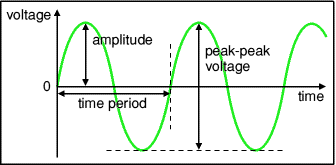
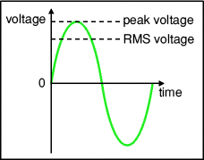

# AC (Alternating Current)

A few important characteristics of an AC Signal:

## Time Period
How much time passes during one cycle of the signal (until it reaches the same point it started twice)

## Frequency
How many cycles the signal completes in a specified time frame.

## Amplitute
The maximum voltage of the signal compared to 0

## Peak-Peak Voltage
The difference between the highest and lowest peak.

## Root Mean Square Values
This helps calculating the current an equivalent DC Signal would need to provide the same amount of power.

$$
\begin{flalign}
V_{RMS} = 0.7 * V_{PEAK} &&\\
V_{PEAK} = 1.4 * V_{RMS}
\end{flalign}
$$
