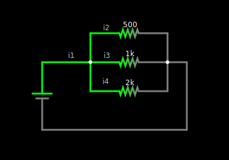

# Ohms Law
Solve for voltage:

$$
\begin{flalign}
V &= \frac{I}{R}&
\end{flalign}
$$
*Solve for resistance:*

$$
\begin{flalign}
R &= \frac{V}{I} &
\end{flalign}
$$
_Solve for current_
$$
\begin{flalign}
I & = \frac{V}{R} &
\end{flalign}
$$

# Resistors in Series

$$
\begin{flalign}
R &= R1 + R2 + R3 ... &
\end{flalign}
$$

# Resistors in Parallel

$$
\begin{flalign}
\frac{1}{R} = \frac{1}{R1} + \frac{1}{R2} + \frac{1}{R3} ... &&\\
\\
\textit{For two resistors in parallel:} &&\\
\\
R = \frac{R1 * R2}{R1 + R2} &&\\
\end{flalign}
$$

***Tip:***
If resistors of the same value are in parallel the total resistance is a single resistor divided by the amount if resistors.

# Kirchhoff's Law

## Conservation of Charge (First Law)

All current entering a node must also leave that node

$$
\begin{flalign}
\sum{I_{IN}} = \sum{I_{OUT}}&&
\end{flalign}
$$

**Example:**

For this circuit kirchhoffs law states that:
$$
\begin{flalign}
i1 = i2 + i3 + i4 &&
\end{flalign}
$$

## Conservation of Energy (Second Law)
All the potential differences around the loop must sum to zero.
$$
\begin{flalign}
\sum{V} = 0 &&
\end{flalign}
$$

