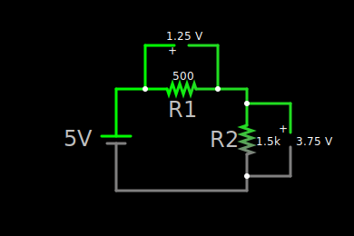

# Kirchhoffs Law

### Example 1
**Example:**



For this circuit this means.

$$
\begin{flalign}
V_{R1} = -(I*R1) && \text{Voltage Drop across R}_{1} \\
V_{R2} = -(I*R2) && \text{Voltage Drop across R}_{2}\\
\\

V_{S} - IR_{1} - IR_{2} &= 0 & | + IR_{1} + IR_{2}\\
V_{S} &= IR_{1} + IR_{2} \\
\\
V_{S} &= I(R_{1}+R_{2}) \\
V_{S} &= I*R_{t} \\

\end{flalign}
$$

We can change that formula around to find out the current of the entire circuit, aswell as current through single resistors

$$
\begin{flalign}
I &= I*R_{t} = \frac{V_{S}}{R_{t}} = \frac{V_{S}}{R_{1}+R_{2}}\\
\\
VR_{1} &= V_{S}(\frac{R1}{R1+R2})\\
VR_{2} &= V_{S}(\frac{R2}{R1+R2})\\
\\
VR_{1} &= 5(\frac{500}{500+1500})\\
VR_{1} &= 1.25v&\\
\\
VR_{2} &= 5(\frac{1500}{500+1500})\\
VR_{2} &= 3.75v

\end{flalign}
$$

### Example 2


```circuitjs
$ 1 0.000005 10.20027730826997 50 5 43 5e-11
v 192 288 192 112 0 0 40 10 0 0 1
x 125 208 167 211 4 24 10V
r 192 112 336 112 0 10
r 336 112 480 112 0 20
w 480 112 480 288 0
r 336 112 336 288 0 50
w 480 288 336 288 0
w 336 288 192 288 0
x 304 204 319 207 4 12 R3
x 256 140 271 143 4 12 R1
x 400 138 415 141 4 12 R2
x 332 104 340 107 4 12 A
x 332 304 340 307 4 12 B
x 205 102 215 105 4 12 I1
x 467 105 477 108 4 12 I2
x 346 276 356 279 4 12 I3
```

In this circuit we have three major loops we can apply [[formulas#Conservation of Energy Second Law|Kirchhoffs Second Law]] to, the one on the left, the one on the right and the most outer one. We can also use [[formulas#Conservation of Charge First Law | Kirchhoffs First Law]] for the node title **A**.

$$
\begin{flalign}
&\textit{Node A:}  \\\
& I_{1} = I_{2}+I_{3}  \\
\\
&\textit{Left Loop:} \circlearrowright &\\
& 10_{v} - I_{1}*R_{1} - I_{3}*R_{3} = 0& \\
\\
&\textit{Right Loop} \circlearrowleft &\\
&I_{2}*R_{2} - I_{3}*R_{3} = 0; &\\
\\
&\textit{Outer Loop:} \circlearrowright &\\
& 10_{v} - I_{1}*R_{1} - I_{2}*R_{2} = 0& \\
\\
\end{flalign}
$$

Now if we would like to find out I2 for example we can use the Right Loop Formula to do so:

$$
\begin{flalign}
& \textit{Right Loop} \circlearrowleft &\\
& I_{2}*R_{2} - I_{3}*R_{3} = 0 &&| + I_{3}*R_{3}\\\
\\
& I_{2}*R_{2} = I_{3}*R_{3} &&| \div R_{2} \\
\\
& I_{2} = \frac{I_{3}*R_{3}}{R_{2}} &&| \text{ Input Numbers } \\
\\
& I_{2} = \frac{I_{3}*5}{2} &&| \text{ Simplify} \\
\\
& I_{2} = \frac{5I_{3}}{2} &&| \text{ Simplify} \\
\\
&\textit{LeftLoop:} \\
& 10 - I_{1}*R_{1} - I_{3}*R_{3} = 0&&| \text{ Replace I1 with node a}  \\
& 10 - (I_{2}+I_{3})*R_{1} - I_{3}*R_{3} = 0 &&| \text{ Replace I2 with previous} \\
\\
& 10 - (\frac{5I_{3}}{2}+I_{3})*R_{1} - I_{2}*R_{2} = 0
\end{flalign}
$$

On the last formula we only have one unknown variable, which is $I_{3}$ so lets solve for that.

$$
\begin{flalign}
& 10 - (\frac{5I_{3}}{2}+I_{3})R_{1} - I_{3}R_{3} = 0 &&| \text{ Replace Variables}\\\
\\
& 10 - (2.5I_{3}+I_{3})10 - 50I_{3} = 0 && \\
\\
& 10 - 35I_{3} - 50I_{3} = 0 &&\\
& 10 - 85I_{3} = 0 && | +85I_{3}\\
& 10 = 85I_{3} && | \div 85 \\
& 0.117647059 \approx I_{3} \\
& 117.64mA = I_{3}
\end{flalign}
$$

Now lets found out $I_{2}$ aswell

$$
\begin{flalign}
I_{2} = \frac{I_{3}*5}{2} &&\\
I_{2} = \frac{0.11764 * 5}{2} &&\\
\\
I_{2} \approx 0.2941 && \\
\\
I_2 \approx 294mA && \\
\end{flalign}
$$