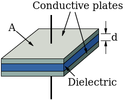
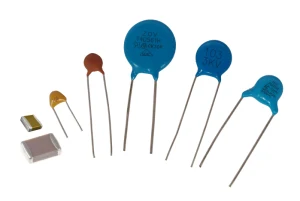
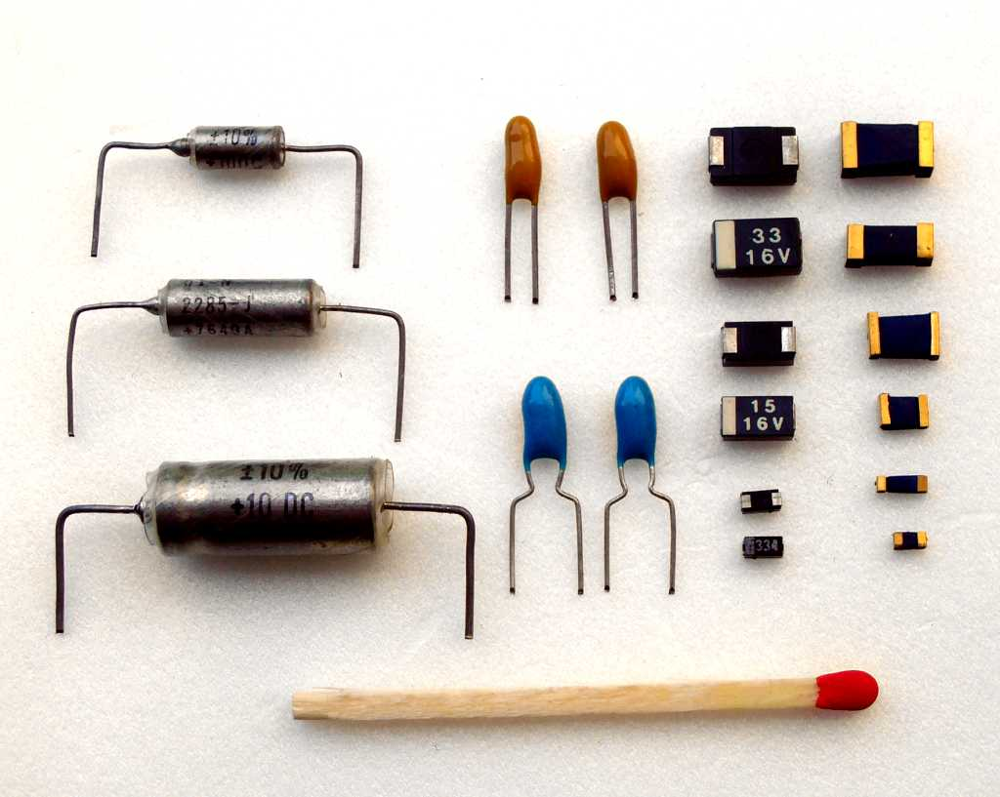

# Capacitors

Capacity is measured in [[glossary#Farad|Farads]].

Capacity is calculated as follows:

$$
\begin{flalign}
& C = \epsilon r \frac{A}{4\pi d} &&\\\
\\
& \epsilon r = \text{Dielectrics relative permittivity} &&\\
& A = \text{Amount of Area the plates overlap} &&\\
& d = \text{Distance between plates} &&\\
\end{flalign}
$$

### Important Metrics

**Size:**
Larger Capacity $\approx$ Larger Size

**Maximum Voltage**
Each capacitor has a maximum voltage that can be dropped across it.

**Leakage Current**
Capacitors are not perfect, and leak some current across the terminals.

**Equivalent series Resistance (ESR)**
The terminals are not 100% conductive, so the will have some very small resistance, (usually less than $0.01\ohm$)

**Tolerance**
The capacity is not always exact, the tolerance describes how much it could vary, usually about $\mp 1\%$ to $\mp 20\%$

## Ceramic Capacitors
- least expansive
- relative small usually $< 10\micro F$
- low current leakage and ESR
- best for high frequency coupling

## Aluminium and Tantalum Electrolytic
- Usually polarized
- Capacity usuially $1\micro F - 1mF$
- Good for high voltage

## Super Capacitors

- Usually can handle only low voltage
- Capacity in the range of farads

## Film Capacitor
- usually low ESR

## Mica Capacitor
- Can work in hot environments > $200\deg$
- Low ESR
- High Precision
- High Cost